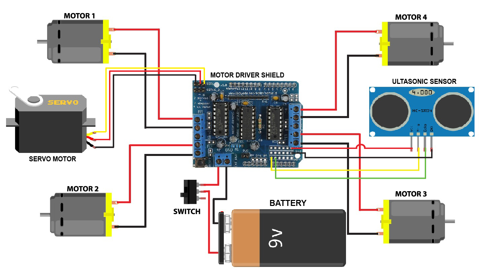

# Obstacle Avoiding Car

## Overview

This project showcases an obstacle-avoiding car that autonomously navigates its environment using sensors to detect obstacles. The car's movements are controlled by a microcontroller, and it is designed to intelligently avoid obstacles in its path.

## Table of Contents

- [Hardware Components](#hardware-components)
- [Software Components](#software-components)
- [Circuit Diagram](#circuit-diagram)
- [Setup Instructions](#setup-instructions)
- [Usage](#usage)
- [Troubleshooting](#troubleshooting)
- [License](#license)
- [Acknowledgments](#acknowledgments)

## Hardware Components

- **Chassis:** The physical structure of the car.
- **Wheels and Motors:** Responsible for the car's movement.
- **Obstacle Detection Sensors:** These sensors (e.g., ultrasonic sensors) detect obstacles in the car's path.
- **Microcontroller/Processor:** Controls the car's movements based on sensor inputs (e.g., Arduino, Raspberry Pi).
- **Power Supply:** Provides power to the motors and other electronic components.

## Software Components

- **Arduino Code (or equivalent):** The program that runs on the microcontroller. It reads sensor data and controls the motors to navigate the car.
- **Motor Control Library:** If not using pre-built motor control functions, you might need a library or custom code to control the motors.
- **Sensor Interface Code:** Code to read data from the obstacle detection sensors.
- **Obstacle Avoidance Algorithm:** Logic to decide how the car should maneuver to avoid obstacles.
- **Power Management Code:** If necessary, code to manage power distribution and consumption.

## Circuit Diagram

<kbd></kbd>

## Setup Instructions

1. **Assemble the Hardware:** Put together the chassis, attach the wheels and motors, and connect the obstacle detection sensors.
2. **Install the Required Software:** If using an Arduino or Raspberry Pi, install the necessary development environment and libraries.
3. **Upload Code to the Microcontroller:** Use a USB cable to upload the compiled Arduino code to the microcontroller.
4. **Check Wiring:** Ensure that all connections are correct, and there are no loose wires.
5. **Power On the System:** Connect the power supply and turn on the car.

## Usage

1. **Place the Car in an Open Area:** Ensure there are obstacles in the car's path.
2. **Turn On the Car:** The car should start moving forward until it detects an obstacle.
3. **Obstacle Detection:** When an obstacle is detected, the car should autonomously navigate around it.
4. **Monitor Performance:** Observe how well the car avoids obstacles and make adjustments to the code or hardware if needed.

## Troubleshooting

- If the car is not moving as expected, check the sensor readings and motor control code.
- Ensure that the obstacle detection sensors are not obstructed or damaged.
- Verify that the power supply is providing sufficient power to the motors.

## License

This project is licensed under the [MIT License](LICENSE).

## Acknowledgments

- Mention any external libraries, code snippets, or inspiration used in the project.
